# 파이프라인 아키텍처 개요
이 문서는 3D 재구성 파이프라인의 아키텍처에 대한 개요를 제공합니다. 이 파이프라인은 이미지 전처리, 카메라 포즈 추정, 배경 제거, 3D 재구성, Feature 추출 및 lifting 등 여러 단계를 포함하며, 각 단계는 특정 도구와 기술을 사용하여 구현됩니다.

## 1. 개요
3D 재구성 파이프라인은 다음과 같은 주요 단계로 구성됩니다:
1. **이미지 전처리** (Real-ESRGAN)
2. **카메라 포즈 추정** (COLMAP)
3. **배경 제거** (Rembg - 선택적)
4. **3D 재구성** (3DGS or SuGaR)
   - 4a. SuGaR 사용 시: 메쉬 추출 및 텍스처 매핑
   - 4b. Pruning 및 Axes Alignment
5. **이미지 Feature 추출** (DINO → SAM → CLIP)
6. **Feature Lifting 및 최적화** (CF3)
7. **최종 결과물**
   - `feature_field.ply`
   - `autoencoder.pth`
   - `point_cloud.ply` (또는 SuGaR 사용 시 `.glb`)
   - `point_cloud_pruned_pose.json`

## 2. 아키텍처 다이어그램
아래 다이어그램은 파이프라인의 각 구성 요소와 데이터 흐름을 시각적으로 나타냅니다.

```mermaid
flowchart TB
    %% Input
    START([원본 이미지들]) --> PREPROCESS

    %% Phase 0: Preprocessing
    subgraph PHASE0["Phase 0: 이미지 전처리"]
        PREPROCESS[Real-ESRGAN<br/>이미지 업스케일링<br/>품질 향상]
    end
    
    PREPROCESS --> COLMAP

    %% Phase 1: COLMAP
    subgraph PHASE1["Phase 1: 카메라 포즈 추정"]
        COLMAP[COLMAP<br/>Feature Extraction<br/>Matching<br/>SfM]
    end
    
    COLMAP --> REMBG

    %% Phase 2: Background Removal (Optional)
    subgraph PHASE2["Phase 2: 배경 제거 선택적"]
        REMBG[Rembg<br/>U2Net 모델<br/>마스크 생성]
    end
    
    REMBG --> CHOICE{3D 재구성<br/>방법 선택}

    %% Phase 3-4: 3D Reconstruction Branch
    CHOICE -->|3DGS| GS[3D Gaussian Splatting<br/>포인트 클라우드 생성]
    CHOICE -->|SuGaR| SUGAR_TRAIN[Surface-Aligned 3DGS<br/>표면 정렬<br/>Gaussian Splatting]
    
    %% SuGaR splits into two paths
    SUGAR_TRAIN --> SUGAR_TO_FEATURE[Feature Field 생성 경로]
    SUGAR_TRAIN --> SUGAR_TO_MESH[메쉬 생성 경로]
    
    %% Path 1: SuGaR to Feature Field (same as 3DGS)
    SUGAR_TO_FEATURE --> PRUNING
    
    %% Path 2: SuGaR to Mesh
    subgraph PHASE4a["Phase 4a: SuGaR 메쉬 생성"]
        SUGAR_TO_MESH --> SUGAR_COARSE[Coarse SuGaR<br/>밀도 학습]
        SUGAR_COARSE --> SUGAR_MESH[메쉬 추출<br/>Poisson/Alpha]
        SUGAR_MESH --> SUGAR_REFINE[Refined SuGaR<br/>고품질 학습]
        SUGAR_REFINE --> SUGAR_TEXTURE[UV 텍스처 매핑<br/>.glb 파일 생성]
    end
    
    %% Phase 4b: Post-processing (for Feature Field)
    subgraph PHASE4b["Phase 4b: Post-processing"]
        PRUNING[Pruning<br/>노이즈 제거<br/>최적화]
        PRUNING --> AXES[Axes Alignment<br/>좌표계 정렬<br/>포즈 추정]
    end
    
    %% Merge 3DGS path to post-processing
    GS --> PRUNING
    
    AXES --> FEATURE_EXTRACT

    %% Phase 5: Feature Extraction
    subgraph PHASE5["Phase 5: 이미지 Feature 추출"]
        FEATURE_EXTRACT[DINO v2<br/>Self-supervised<br/>Feature 추출]
        FEATURE_EXTRACT --> SAM[SAM Masking<br/>Segment Anything<br/>객체 분할]
        SAM --> CLIP[CLIP Text Embedding<br/>텍스트-이미지 연결<br/>의미론적 특징]
    end
    
    CLIP --> CF3

    %% Phase 6: Feature Lifting
    subgraph PHASE6["Phase 6: Feature Field 생성"]
        CF3[CF3 Feature Lifting<br/>2D → 3D 변환<br/>Feature Field 최적화]
    end
    
    CF3 --> OUTPUT_FEATURE
    SUGAR_TEXTURE --> OUTPUT_MESH

    %% Final Output
    subgraph OUTPUT_FEATURE["Feature Field 결과물"]
        OUT1[feature_field.ply<br/>3D Feature Field]
        OUT2[autoencoder.pth<br/>Feature 압축 모델]
        OUT3[point_cloud.ply<br/>3D 포인트 클라우드<br/>또는 Surface-Aligned 3DGS]
        OUT4[point_cloud_pruned_pose.json<br/>좌표계 및 포즈 정보]
    end
    
    subgraph OUTPUT_MESH["메쉬 결과물 SuGaR only"]
        OUT5[mesh.glb<br/>UV 텍스처 메쉬<br/>3D 모델]
    end

    OUTPUT_FEATURE --> END([완료])
    OUTPUT_MESH --> END

    %% Styling
    classDef preprocessing fill:#e1f5ff,stroke:#0288d1,stroke-width:2px
    classDef colmap fill:#fff3e0,stroke:#f57c00,stroke-width:2px
    classDef rembg fill:#f3e5f5,stroke:#7b1fa2,stroke-width:2px
    classDef gs fill:#e8f5e9,stroke:#388e3c,stroke-width:2px
    classDef sugar fill:#fff9c4,stroke:#f9a825,stroke-width:2px
    classDef sugarpath fill:#ffe0b2,stroke:#e65100,stroke-width:2px
    classDef pruning fill:#fce4ec,stroke:#c2185b,stroke-width:2px
    classDef feature fill:#e0f2f1,stroke:#00796b,stroke-width:2px
    classDef cf3 fill:#ede7f6,stroke:#512da8,stroke-width:2px
    classDef output fill:#ffebee,stroke:#d32f2f,stroke-width:3px
    classDef mesh fill:#ffd54f,stroke:#f57f17,stroke-width:3px
    
    class PREPROCESS preprocessing
    class COLMAP colmap
    class REMBG rembg
    class GS gs
    class SUGAR_TRAIN,SUGAR_TO_FEATURE,SUGAR_TO_MESH sugarpath
    class SUGAR_COARSE,SUGAR_MESH,SUGAR_REFINE,SUGAR_TEXTURE sugar
    class PRUNING,AXES pruning
    class FEATURE_EXTRACT,SAM,CLIP feature
    class CF3 cf3
    class OUT1,OUT2,OUT3,OUT4 output
    class OUT5 mesh
```



### 다이어그램 설명

#### 🔵 Phase 0: 이미지 전처리 (Real-ESRGAN)
- 저해상도 이미지를 고해상도로 변환 (최대 4배)
- 이미지 품질 향상 및 노이즈 제거
- **출력**: 향상된 이미지 세트

#### 🟠 Phase 1: 카메라 포즈 추정 (COLMAP)
- Feature 추출 및 매칭
- Structure from Motion (SfM)
- **출력**: `sparse/` 디렉토리 (카메라 포즈, 포인트 클라우드)

#### 🟣 Phase 2: 배경 제거 (Rembg) - 선택적
- U2Net 딥러닝 모델 사용
- 자동 배경 제거 마스크 생성
- **출력**: `masks/` 디렉토리

#### 🟢 Phase 3-4: 3D 재구성

**Option A: 3D Gaussian Splatting (3DGS)**
- 빠른 학습 및 렌더링
- 포인트 클라우드 기반
- **출력**: `point_cloud.ply`
- **다음 단계**: 후처리 → Feature 추출 → CF3

**Option B: SuGaR (Surface-Aligned Gaussian Splatting)**
- **Phase 4: Surface-Aligned 3DGS 학습**
  - 표면 정렬된 Gaussian Splatting 생성
  - 두 가지 경로로 분기:
  
  **경로 1: Feature Field 생성** (3DGS와 동일한 프로세스)
  - Surface-Aligned 3DGS → 후처리 → Feature 추출 → CF3
  - **출력**: `feature_field.ply`, `autoencoder.pth`, `point_cloud.ply`, `point_cloud_pruned_pose.json`
  
  **경로 2: 메쉬 생성** (SuGaR 전용)
  - Phase 4a 추가 단계:
    1. **Coarse SuGaR**: 밀도 학습 및 표면 정렬
    2. **메쉬 추출**: Poisson 또는 Alpha 알고리즘
    3. **Refined SuGaR**: Triangle당 Gaussian 최적화
    4. **텍스처 매핑**: UV 매핑 및 GLB 파일 생성
  - **출력**: `mesh_textured/*.glb` (3D 메쉬 + 텍스처)

**핵심**: SuGaR 사용 시 두 가지 결과물을 동시에 얻을 수 있습니다:
1. Feature Field (LangSplat/CF3용) - 경로 1
2. 고품질 텍스처 메쉬 - 경로 2

#### 🔴 Phase 4b: 후처리 (Feature Field 생성용)
1. **Pruning**
   - 통계적 이상치 제거 (Gaussian Scoring and eigenvalue 분석)
   - 노이즈 포인트 삭제
   - 메모리 최적화

2. **Axes Alignment**
   - 좌표계 정렬 (주축 추정)
   - 포즈 변환 행렬 계산
   - **출력**: `point_cloud_pruned_pose.json` (좌표계 정보, 카메라 프리셋 등)

**참고**: 이 후처리 단계는 3DGS와 SuGaR의 Surface-Aligned 3DGS 모두에 적용되어 Feature Field를 생성합니다. SuGaR의 메쉬 생성 경로는 별도로 진행됩니다.

#### 🟢 Phase 5: 이미지 Feature 추출

**다단계 Feature 추출 파이프라인:**

1. **DINO v2** (Self-supervised Learning)
   - Vision Transformer 기반
   - 의미론적 특징 추출

2. **SAM** (Segment Anything Model)
   - 객체 자동 분할
   - 마스크 기반 Feature 정제
   - 정확한 객체 경계 추출

3. **CLIP** (Text Embedding)
   - DINO에서 출력한 특징 텍스트 임베딩
   - 512차원 Feature 벡터

**출력**: 멀티모달 Feature 맵

#### 🟣 Phase 6: Feature Lifting (CF3)
- **CF3** (Compact Feature Field)
- 2D Feature를 3D 공간으로 변환
- Feature Field 최적화 및 압축
- Autoencoder 학습 (Feature 차원 축소)
- **출력**: `feature_field.ply`, `autoencoder.pth`

## 3. 최종 결과물

파이프라인 완료 후 다음 4가지 핵심 파일이 생성됩니다:

### 3.1 `feature_field.ply`
```
용도: 3D 의미론적 검색 및 세그멘테이션
구조: 
  - 3D 좌표 (x, y, z)
  - Feature 벡터 (DINO + SAM + CLIP)
  - 압축된 Feature Field
활용:
  - 텍스트 기반 3D 검색
  - 객체 분할 및 인식
  - 의미론적 편집
```

### 3.2 `point_cloud.ply` 또는 `mesh.glb`

**3DGS 사용 시:**
```
point_cloud.ply
  - Gaussian Splatting 포인트 클라우드
  - 빠른 렌더링 지원
  - 실시간 뷰어 호환
  - Feature Field와 연동
```

**SuGaR 사용 시 (이중 출력):**
```
1. point_cloud.ply (경로 1: Feature Field용)
   - Surface-Aligned Gaussian Splatting
   - 표면 정렬된 포인트 클라우드
   - LangSplat/CF3 Feature 추출에 사용
   - 3DGS와 동일한 후처리 적용

2. mesh.glb (경로 2: 메쉬 전용)
   - mesh_textured/*.glb
   - UV 텍스처 메쉬
   - 표준 3D 포맷 (Blender, Unity 호환)
   - 고품질 텍스처 매핑
   - 메쉬 생성 전용 파이프라인 결과물
```

**핵심 차이점:**
- SuGaR는 **두 가지 출력물**을 생성합니다
- `point_cloud.ply`: Feature Field 생성에 사용 (LangSplat 전처리)
- `mesh.glb`: 최종 3D 메쉬 (시각화/편집용)

### 3.3 `point_cloud_pruned_pose.json`
```json
{
  "center": [0.0, 0.0, 0.0],
  "forward": [1.0, 0.0, 0.0],
  "up": [0.0, 1.0, 0.0],
  "side": [0.0, 0.0, 1.0],
  "bbox_local": {
    "height": [-1.2, 1.5],
    "width": [-0.9, 0.9],
    "length": [-2.1, 2.3]
  },
  "initial_camera_position": [5.0, 3.0, 5.0],
  "camera_presets": {
    "front": {
      "position": [5.0, 1.5, 0.0],
      "target": [0.0, 0.0, 0.0],
      "up": [0.0, 1.0, 0.0]
    }
  },
  "query_presets": {
    "wheel": {
      "surface_normal": [-0.123, 0.456, -0.789],
      "camera_position": [1.234, 2.345, 3.456],
      "surface_center": [0.123, 0.234, 0.345],
      "timestamp": "2026-01-20T12:34:56"
    }
  }
}
```

**포함 정보**:
- **center**: 3D 모델의 중심점 좌표
- **forward/up/side**: 좌표계 축 방향 벡터
- **bbox_local**: 로컬 바운딩 박스 (높이/너비/길이)
- **initial_camera_position**: 초기 카메라 위치
- **camera_presets**: 사전 정의된 카메라 뷰 (front, back, left, right, top 등)
- **query_presets**: 텍스트 쿼리별 카메라 뷰 (히트맵 생성 시 저장)

### 3.4 `autoencoder.pth`
```
용도: Feature Field 압축 및 복원을 위한 Autoencoder 모델
생성 위치: CF3 Feature Lifting 단계
구조:
  - Encoder: 고차원 Feature → 저차원 Latent Space
  - Decoder: 저차원 Latent Space → 고차원 Feature
  - 학습된 가중치 (PyTorch state_dict)
활용:
  - 3D 의미론적 세그멘테이션 (3d_seg.py)
  - Feature Field 압축 (메모리 최적화)
  - Feature 복원 및 시각화
파일 크기: 일반적으로 10-50MB
로딩 방법:
  ae = Autoencoder(feature_size).to(device)
  ae.load_state_dict(torch.load("autoencoder.pth"))
```

## 4. 데이터 흐름 요약

### 3DGS 파이프라인
```
원본 이미지
    ↓ (Real-ESRGAN)
향상된 이미지
    ↓ (COLMAP)
카메라 포즈 + 희소 포인트 클라우드
    ↓ (Rembg - 선택적)
배경 마스크
    ↓ (3DGS)
3D Gaussian Splatting → point_cloud.ply
    ↓ (Pruning + Alignment)
최적화된 3D 모델 + point_cloud_pruned_pose.json
    ↓ (DINO → SAM → CLIP)
멀티모달 Features
    ↓ (CF3)
feature_field.ply
```

### SuGaR 파이프라인 (이중 출력)
```
원본 이미지
    ↓ (Real-ESRGAN)
향상된 이미지
    ↓ (COLMAP)
카메라 포즈 + 희소 포인트 클라우드
    ↓ (Rembg - 선택적)
배경 마스크
    ↓ (Surface-Aligned 3DGS)
표면 정렬 Gaussian Splatting
    ↓
    ├─ 경로 1: Feature Field 생성
    │   ↓ (Pruning + Alignment)
    │   최적화된 3D 모델 + point_cloud_pruned_pose.json
    │   ↓ (DINO → SAM → CLIP)
    │   멀티모달 Features
    │   ↓ (CF3)
    │   feature_field.ply + point_cloud.ply
    │
    └─ 경로 2: 메쉬 생성
        ↓ (Coarse SuGaR)
        밀도 학습
        ↓ (Mesh Extraction)
        메쉬 추출
        ↓ (Refined SuGaR)
        고품질 최적화
        ↓ (UV Texture Mapping)
        mesh.glb
```

## 5. 기술 스택 요약

| 단계 | 도구/기술 | 프레임워크 |
|------|-----------|------------|
| 전처리 | Real-ESRGAN | PyTorch |
| 포즈 추정 | COLMAP | C++ |
| 배경 제거 | Rembg (U2Net) | PyTorch |
| 3D 재구성 | 3DGS / SuGaR | PyTorch + CUDA |
| 메쉬 생성 | Poisson/Alpha | Open3D |
| Pruning | Gaussian Scoring | NumPy |
| Feature 추출 | DINO v2 | PyTorch |
| Masking | SAM | PyTorch |
| Text Embedding | CLIP | PyTorch |
| Feature Lifting | CF3 | PyTorch + CUDA |

## 6. 시스템 요구사항

### 최소 사양
- GPU: 8GB VRAM (3DGS)
- RAM: 32GB
- Storage: 100GB

### 권장 사양  
- GPU: 16GB+ VRAM (SuGaR + 고해상도)
- RAM: 64GB
- Storage: 500GB SSD

### 현재 개발 환경
- GPU: NVIDIA GB10
- CUDA: 13.0
- PyTorch: 2.9
- Docker: 28.5.1

---

**SNUKDT 11기 코오롱 모빌리티그룹 캡스톤 프로젝트 팀**
