# SNUKDT 11기 코오롱 모빌리티그룹 캡스톤 프로젝트: 3D Reconstruction Pipeline

SNUKDT 11기 코오롱 모빌리티그룹 캡스톤 프로젝트 - 3D 재구성 파이프라인

이 프로젝트는 이미지에서 3D Feature Field와 텍스처 메쉬를 생성하는 완전 자동화된 파이프라인입니다. Real-ESRGAN, COLMAP, 3D Gaussian Splatting, SuGaR, 그리고 CF3를 결합하여 3D 재구성과 의미론적 세그멘테이션을 지원합니다.

---

## 목차

- [시스템 요구사항](#-시스템-요구사항)
- [핵심 기술 스택](#-핵심-기술-스택)
- [아키텍처 개요](#-아키텍처-개요)
  - [Multi-Container Docker 구조](#multi-container-docker-구조)
  - [전체 파이프라인 플로우](#전체-파이프라인-플로우)
- [빠른 시작](#-빠른-시작)
- [상세 가이드](#-상세-가이드)
- [출력 파일](#-출력-파일)
- [Troubleshooting](#-troubleshooting)

---

## 시스템 요구사항

### 최소 사양
- **GPU**: NVIDIA GPU with 8GB+ VRAM
- **RAM**: 32GB
- **Storage**: 100GB
- **OS**: Ubuntu 20.04/22.04

### 권장 사양
- **GPU**: NVIDIA GPU with 16GB+ VRAM (SuGaR 사용 시)
- **RAM**: 64GB
- **Storage**: 500GB SSD

### 현재 개발 환경
- **GPU**: NVIDIA GB10
- **Driver**: 580.95.05
- **CUDA**: 13.0.88
- **Docker**: 28.5.1
- **Docker Compose**: v2.40.0
- **PyTorch**: 2.9
- **Python**: 3.10 (SuGaR) / 3.12 (Pipeline)

---

## 🔧 핵심 기술 스택

### 소프트웨어 버전
```
NVIDIA Driver:    580.95.05
CUDA Toolkit:     13.0.88
Docker:           28.5.1
Docker Compose:   v2.40.0
PyTorch:          2.9
Python:           3.10 / 3.12
```

### 주요 기술
| 단계 | 도구/기술 | 프레임워크 |
|------|-----------|------------|
| 전처리 | Real-ESRGAN | PyTorch |
| 포즈 추정 | COLMAP | C++ |
| 배경 제거 | Rembg (U2Net) | PyTorch |
| 3D 재구성 | 3DGS / SuGaR | PyTorch + CUDA |
| 메쉬 생성 | Poisson/Alpha | Open3D |
| Pruning | Gaussian Scoring | NumPy |
| Feature 추출 | DINO v2 | PyTorch |
| Masking | SAM | PyTorch |
| Text Embedding | CLIP | PyTorch |
| Feature Lifting | CF3 | PyTorch + CUDA |

---

## 아키텍처 개요

### Multi-Container Docker 구조

```
┌─────────────────────────────────────────────────────────────────┐
│                  Docker Network: pipeline_net                   │
├─────────────────────────────────────────────────────────────────┤
│                                                                 │
│  ┌──────────────────┐  ┌──────────────────┐                     │
│  │   Real-ESRGAN    │  │      Rembg       │                     │
│  │  Preprocessing   │  │  Background      │                     │
│  │                  │  │  Removal         │                     │
│  │  - Image         │  │  - U2Net Model   │                     │
│  │    Upscaling     │  │  - Mask Gen      │                     │
│  │  - 4x Quality    │  │  - Alpha         │                     │
│  │                  │  │    Matting       │                     │
│  │  SHM: 8GB        │  │  SHM: 8GB        │                     │
│  └──────────────────┘  └──────────────────┘                     │
│                                                                 │
│  ┌─────────────────────────────────────────────────────────┐    │
│  │                  Pipeline Container                     │    │
│  │                                                         │    │
│  │  - COLMAP (Camera Pose Estimation)                      │    │
│  │  - 3D Gaussian Splatting (3DGS)                         │    │
│  │  - Pruning & Axes Alignment                             │    │
│  │  - DINO v2 → SAM → CLIP (Feature Extraction)            │    │
│  │  - CF3 (Feature Field Lifting)                          │    │
│  │                                                         │    │
│  │  SHM: 64GB                                              │    │
│  └─────────────────────────────────────────────────────────┘    │
│                                                                 │
│  ┌─────────────────────────────────────────────────────────┐    │
│  │                   SuGaR Container                       │    │
│  │                                                         │    │
│  │  - Surface-Aligned 3DGS                                 │    │
│  │  - Mesh Extraction (Poisson/Alpha)                      │    │
│  │  - Refined SuGaR Training                               │    │
│  │  - UV Texture Mapping                                   │    │
│  │                                                         │    │
│  │  SHM: 64GB                                              │    │
│  └─────────────────────────────────────────────────────────┘    │
│                                                                 │
│  ┌─────────────────────────────────────────────────────────┐    │
│  │                  Shared Data Volume                     │    │
│  │                                                         │    │
│  │  ./data/ ←→ /app/data (Real-ESRGAN, Rembg)              │    │
│  │           ←→ /workspace/data (Pipeline, SuGaR)          │    │
│  │                                                         │    │
│  │  ├── project_name/                                      │    │
│  │  │   ├── input/              # 원본 이미지                 │    │
│  │  │   ├── enhanced/           # Real-ESRGAN 출력          │    │
│  │  │   ├── images/             # COLMAP 입력               │    │
│  │  │   ├── masks/              # Rembg 출력                │    │
│  │  │   ├── sparse/             # COLMAP 출력               │    │
│  │  │   ├── output_vanilla/     # 3DGS 출력                 │    │
│  │  │   ├── output_coarse/      # Coarse SuGaR             │    │
│  │  │   ├── output_refined/     # Refined SuGaR            │    │
│  │  │   └── mesh_textured/      # 최종 메쉬                  │    │
│  └─────────────────────────────────────────────────────────┘    │
│                                                                 │
│  All containers have GPU access via:                            │
│  deploy.resources.reservations.devices (nvidia, count: all)     │
└─────────────────────────────────────────────────────────────────┘
```

### 전체 파이프라인 플로우

```mermaid
flowchart TB
    %% Input
    START([원본 이미지들]) --> PREPROCESS

    %% Phase 0: Preprocessing
    subgraph PHASE0["Phase 0: 이미지 전처리"]
        PREPROCESS[Real-ESRGAN<br/>이미지 업스케일링<br/>품질 향상]
    end
    
    PREPROCESS --> COLMAP

    %% Phase 1: COLMAP
    subgraph PHASE1["Phase 1: 카메라 포즈 추정"]
        COLMAP[COLMAP<br/>Feature Extraction<br/>Matching<br/>SfM]
    end
    
    COLMAP --> REMBG

    %% Phase 2: Background Removal (Optional)
    subgraph PHASE2["Phase 2: 배경 제거 선택적"]
        REMBG[Rembg<br/>U2Net 모델<br/>마스크 생성]
    end
    
    REMBG --> CHOICE{3D 재구성<br/>방법 선택}

    %% Phase 3-4: 3D Reconstruction Branch
    CHOICE -->|3DGS| GS[3D Gaussian Splatting<br/>포인트 클라우드 생성]
    CHOICE -->|SuGaR| SUGAR_TRAIN[Surface-Aligned 3DGS<br/>표면 정렬<br/>Gaussian Splatting]
    
    %% SuGaR splits into two paths
    SUGAR_TRAIN --> SUGAR_TO_FEATURE[Feature Field 생성 경로]
    SUGAR_TRAIN --> SUGAR_TO_MESH[메쉬 생성 경로]
    
    %% Path 1: SuGaR to Feature Field (same as 3DGS)
    SUGAR_TO_FEATURE --> PRUNING
    
    %% Path 2: SuGaR to Mesh
    subgraph PHASE4a["Phase 4a: SuGaR 메쉬 생성"]
        SUGAR_TO_MESH --> SUGAR_COARSE[Coarse SuGaR<br/>밀도 학습]
        SUGAR_COARSE --> SUGAR_MESH[메쉬 추출<br/>Poisson/Alpha]
        SUGAR_MESH --> SUGAR_REFINE[Refined SuGaR<br/>고품질 학습]
        SUGAR_REFINE --> SUGAR_TEXTURE[UV 텍스처 매핑<br/>.glb 파일 생성]
    end
    
    %% Phase 4b: Post-processing (for Feature Field)
    subgraph PHASE4b["Phase 4b: Post-processing"]
        PRUNING[Pruning<br/>노이즈 제거<br/>최적화]
        PRUNING --> AXES[Axes Alignment<br/>좌표계 정렬<br/>포즈 추정]
    end
    
    %% Merge 3DGS path to post-processing
    GS --> PRUNING
    
    AXES --> FEATURE_EXTRACT

    %% Phase 5: Feature Extraction
    subgraph PHASE5["Phase 5: 이미지 Feature 추출"]
        FEATURE_EXTRACT[DINO v2<br/>Self-supervised<br/>Feature 추출]
        FEATURE_EXTRACT --> SAM[SAM Masking<br/>Segment Anything<br/>객체 분할]
        SAM --> CLIP[CLIP Text Embedding<br/>텍스트-이미지 연결<br/>의미론적 특징]
    end
    
    CLIP --> CF3

    %% Phase 6: Feature Lifting
    subgraph PHASE6["Phase 6: Feature Field 생성"]
        CF3[CF3 Feature Lifting<br/>2D → 3D 변환<br/>Feature Field 최적화]
    end
    
    CF3 --> OUTPUT_FEATURE
    SUGAR_TEXTURE --> OUTPUT_MESH

    %% Final Output
    subgraph OUTPUT_FEATURE["Feature Field 결과물"]
        OUT1[feature_field.ply<br/>3D Feature Field]
        OUT2[autoencoder.pth<br/>Feature 압축 모델]
        OUT3[point_cloud.ply<br/>3D 포인트 클라우드<br/>또는 Surface-Aligned 3DGS]
        OUT4[point_cloud_pruned_pose.json<br/>좌표계 및 포즈 정보]
    end
    
    subgraph OUTPUT_MESH["메쉬 결과물 SuGaR only"]
        OUT5[mesh.glb<br/>UV 텍스처 메쉬<br/>3D 모델]
    end

    OUTPUT_FEATURE --> END([완료])
    OUTPUT_MESH --> END

    %% Styling
    classDef preprocessing fill:#e1f5ff,stroke:#0288d1,stroke-width:2px
    classDef colmap fill:#fff3e0,stroke:#f57c00,stroke-width:2px
    classDef rembg fill:#f3e5f5,stroke:#7b1fa2,stroke-width:2px
    classDef gs fill:#e8f5e9,stroke:#388e3c,stroke-width:2px
    classDef sugar fill:#fff9c4,stroke:#f9a825,stroke-width:2px
    classDef sugarpath fill:#ffe0b2,stroke:#e65100,stroke-width:2px
    classDef pruning fill:#fce4ec,stroke:#c2185b,stroke-width:2px
    classDef feature fill:#e0f2f1,stroke:#00796b,stroke-width:2px
    classDef cf3 fill:#ede7f6,stroke:#512da8,stroke-width:2px
    classDef output fill:#ffebee,stroke:#d32f2f,stroke-width:3px
    classDef mesh fill:#ffd54f,stroke:#f57f17,stroke-width:3px
    
    class PREPROCESS preprocessing
    class COLMAP colmap
    class REMBG rembg
    class GS gs
    class SUGAR_TRAIN,SUGAR_TO_FEATURE,SUGAR_TO_MESH sugarpath
    class SUGAR_COARSE,SUGAR_MESH,SUGAR_REFINE,SUGAR_TEXTURE sugar
    class PRUNING,AXES pruning
    class FEATURE_EXTRACT,SAM,CLIP feature
    class CF3 cf3
    class OUT1,OUT2,OUT3,OUT4 output
    class OUT5 mesh
```



---

## 빠른 시작

### 1. 환경 설정

#### CUDA 및 Docker 설치 확인
```bash
# CUDA 버전 확인
nvcc --version

# Docker 버전 확인
docker --version
docker compose version

# NVIDIA Driver 확인
nvidia-smi

# GPU 접근 테스트
docker run --rm --device nvidia.com/gpu=all nvidia/cuda:13.0-base-ubuntu22.04 nvidia-smi
```

**만약 GPU 인식 문제가 있다면:**
```bash
# CDI 구성 재생성
sudo nvidia-ctk cdi generate --output=/etc/cdi/nvidia.yaml
sudo systemctl restart docker
```

### 2. Docker 이미지 빌드

```bash
# 모든 이미지 빌드 (병렬 처리)
docker compose build --parallel

# 또는 개별 빌드
docker compose build realesrgan
docker compose build rembg
docker compose build pipeline
docker compose build sugar
```

### 3. 데이터 준비

```bash
# 프로젝트 디렉토리 생성
mkdir -p ./data/my_project/input

# 원본 이미지를 input 디렉토리에 복사
cp /path/to/your/images/* ./data/my_project/input/
```

### 4. 전체 파이프라인 실행

#### Option A: 자동 스크립트 사용 (3DGS + Feature Field)
```bash
./run_full_pipeline.sh my_project
```

이 스크립트는 다음 단계를 자동으로 실행합니다:
1. Real-ESRGAN 이미지 전처리
2. COLMAP 카메라 포즈 추정
3. 3D Gaussian Splatting 학습
4. Pruning 및 Axes Alignment
5. DINO → SAM → CLIP Feature 추출
6. CF3 Feature Field 생성

#### Option B: SuGaR 파이프라인 (메쉬 생성)
```bash
./sugar_3dgs_script.sh
```

이 스크립트는 다음 단계를 실행합니다:
1. Real-ESRGAN 이미지 전처리
2. ESRGAN 전처리 (리플렉션 제거)
3. COLMAP 카메라 포즈 추정
4. Rembg 배경 제거 (선택적)
5. Vanilla 3DGS 학습
6. Coarse SuGaR 학습
7. Mesh 추출
8. Refined SuGaR 학습
9. UV 텍스처 매핑 및 GLB 생성

#### Option C: 단계별 수동 실행

**Step 1: 이미지 전처리**
```bash
docker compose run --rm realesrgan
```

**Step 2: 배경 제거 (선택적)**
```bash
docker compose run --rm rembg python /app/generate_rembg_masks.py \
  --images_dir /app/data/my_project/images \
  --output_dir /app/data/my_project/masks
```

**Step 3: COLMAP + 3DGS + Feature Field**
```bash
docker compose run --rm pipeline bash

# 컨테이너 내부에서:
cd /workspace
python3 scripts/colmap_pipeline.py --project my_project
python3 scripts/train_3dgs.py --project my_project
python3 scripts/extract_features.py --project my_project
```

**Step 4: SuGaR 메쉬 생성**
```bash
docker compose run --rm sugar bash

# 컨테이너 내부에서:
cd /workspace/SuGaR
python gaussian_splatting/train.py -s /workspace/data/my_project
python train.py -s /workspace/data/my_project -c output_vanilla/chkpnt30000.pth
```

---

## 상세 가이드

프로젝트에는 다음과 같은 상세 가이드 문서가 포함되어 있습니다:

1. **[CUDA_usability_guide.md](./CUDA_usability_guide.md)**
   - CUDA 설치 및 환경 설정
   - Docker GPU 접근 설정
   - CDI 구성 방법
   - Troubleshooting

2. **[Docker_multi-container_guide.md](./Docker_multi-container_guide.md)**
   - 4개 컨테이너 상세 설명
   - 네트워크 구조
   - 볼륨 관리
   - 실전 워크플로우

3. **[Pipeline_architecture_guide.md](./Pipeline_architecture_guide.md)**
   - 파이프라인 단계별 상세 설명
   - 기술 스택 상세
   - 데이터 흐름 다이어그램
   - 출력 파일 형식

---

## 출력 파일

파이프라인 완료 후 다음 파일들이 생성됩니다:

### 3DGS 파이프라인 출력
```
./data/my_project/
├── enhanced/                    # Real-ESRGAN 출력
├── sparse/                      # COLMAP 출력
│   └── 0/
│       ├── cameras.bin
│       ├── images.bin
│       └── points3D.bin
├── output_vanilla/              # 3DGS 출력
│   └── point_cloud.ply
├── feature_field.ply           # CF3 Feature Field 출력
├── autoencoder.pth             # CF3 Autoencoder 모델
└── point_cloud_pruned_pose.json # 좌표계 및 카메라 정보
```

### SuGaR 파이프라인 출력 (추가)
```
./data/my_project/
├── output_coarse/               # Coarse SuGaR
│   ├── sugarfine_3Dgs30000.ply
│   └── coarse_mesh.ply
├── output_refined/              # Refined SuGaR
│   ├── refined_mesh.ply
│   └── refined_30000.ply
└── mesh_textured/               # 최종 메쉬
    ├── mesh.glb                # UV 텍스처 메쉬
    └── texture.png
```

### 파일 설명

#### `feature_field.ply`
- **용도**: 3D 의미론적 검색 및 세그멘테이션
- **구조**: 3D 좌표 + Feature 벡터 (DINO + SAM + CLIP)
- **활용**: 텍스트 기반 3D 검색, 객체 분할

#### `point_cloud.ply`
- **3DGS**: Gaussian Splatting 포인트 클라우드
- **SuGaR**: Surface-Aligned Gaussian Splatting

#### `mesh.glb`
- **SuGaR 전용**: UV 텍스처 메쉬
- **호환성**: Blender, Unity, Three.js 등

#### `point_cloud_pruned_pose.json`
- **용도**: 3D 모델 좌표계 정보 및 카메라 프리셋
- **구조**:
  - center, forward, up, side: 좌표계 축 벡터
  - bbox_local: 바운딩 박스 정보
  - camera_presets: 사전 정의된 카메라 뷰
  - query_presets: 텍스트 쿼리별 카메라 뷰
- **활용**: 카메라 뷰 계산, 3D 시각화, 히트맵 생성

#### `autoencoder.pth`
- **용도**: Feature Field 압축 및 복원
- **구조**: PyTorch Autoencoder 모델 가중치
- **활용**: 3D 의미론적 세그멘테이션, Feature 압축
- **파일 크기**: 10-50MB

---

## Troubleshooting

### GPU 인식 문제

**증상**: 컨테이너에서 CUDA 사용 불가

**해결 방법**:
```bash
# 1. CDI 재생성
sudo nvidia-ctk cdi generate --output=/etc/cdi/nvidia.yaml

# 2. Docker 재시작
sudo systemctl restart docker

# 3. GPU 테스트
docker compose run --rm pipeline python3 -c "import torch; print('CUDA:', torch.cuda.is_available())"
```

### 메모리 부족 오류

**증상**: `CUDA out of memory`

**해결 방법**:
```bash
# GPU 메모리 확인
nvidia-smi

# shared memory 증가 (docker-compose.yml 수정)
shm_size: '128gb'

# PyTorch 캐시 정리
docker compose run --rm pipeline python3 -c "import torch; torch.cuda.empty_cache()"
```

### 권한 문제

**증상**: 데이터 디렉토리 접근 불가

**해결 방법**:
```bash
# 데이터 디렉토리 권한 설정
sudo chown -R $USER:$USER ./data
chmod -R 755 ./data
```

### Docker 이미지 빌드 실패

**증상**: 빌드 중 오류 발생

**해결 방법**:
```bash
# 캐시 없이 재빌드
docker compose build --no-cache [service_name]

# 디스크 공간 확인
df -h

# 사용하지 않는 이미지 정리
docker system prune -a
```

### 로그 확인

```bash
# 특정 서비스 로그
docker compose logs pipeline

# 실시간 로그
docker compose logs -f sugar

# 최근 100줄
docker compose logs --tail=100 pipeline
```

---

## 사용 예시

### 예시 1: 자동차 3D 모델 생성

```bash
# 1. 데이터 준비
mkdir -p ./data/volvo/input
cp ~/Pictures/car_photos/* ./data/volvo/input/

# 2. SuGaR 파이프라인 실행 (메쉬 생성)
./sugar_3dgs_script.sh

# 3. 결과 확인
ls -lh ./data/volvo/mesh_textured/
# mesh.glb 파일이 생성됨

# 4. Blender에서 열기
blender ./data/volvo/mesh_textured/mesh.glb
```

### 예시 2: 3D 의미론적 검색

```bash
# 1. Feature Field 생성
./run_full_pipeline.sh my_scene

# 2. 텍스트 쿼리로 객체 검색
docker compose run --rm pipeline python3 scripts/search_3d.py \
  --query "steering wheel" \
  --feature_field ./data/my_scene/feature_field.ply

# 3. 결과 시각화
python3 scripts/visualize_search_results.py \
  --results search_results.json
```

---

## 관련 프로젝트

- [3D Gaussian Splatting](https://github.com/graphdeco-inria/gaussian-splatting)
- [SuGaR](https://github.com/Anttwo/SuGaR)
- [LangSplat](https://github.com/minghanqin/LangSplat)
- [CF3 (Compact Feature Field)](https://github.com/pfnet/CF3)
- [Real-ESRGAN](https://github.com/xinntao/Real-ESRGAN)
- [COLMAP](https://colmap.github.io/)
- [Rembg](https://github.com/danielgatis/rembg)

---

## 라이선스

이 프로젝트는 여러 오픈소스 프로젝트를 통합하고 있으며, 각 구성 요소는 해당 라이선스를 따릅니다.

---

## 팀

**SNUKDT 11기 코오롱 모빌리티그룹 캡스톤 프로젝트 팀**

---

## 문의

프로젝트 관련 문의사항은 GitHub Issues를 통해 남겨주세요.

---

**Last Updated**: 2026년 1월 20일
